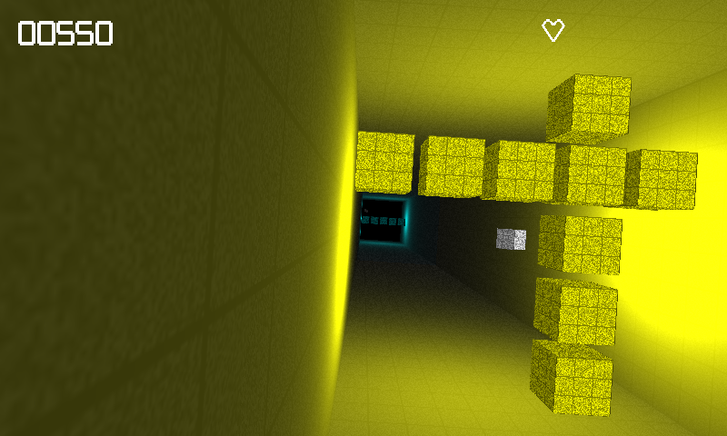

Endless Tunnel
==============
Endless Tunnel is a sample game that shows how to:
- use the Android Studio C++ support
- implement a game using Android native glue
- implement joystick support, including robust DPAD navigation for non-touch screens

The game is based on  [endless-tunnel](https://github.com/googlesamples/android-ndk/tree/master/endless-tunnel)

Pre-requisites
--------------
- Android Studio 2.2+ with [NDK](https://developer.android.com/ndk/) bundle.

Screenshots
-----------

Dependencies
------------
- GLM LIBRARY
  OpenGL Mathematics (GLM) library, available at http://glm.g-truc.net/

- Android Studio CMake plugin
  [Android Studio CMake plugin](http://tools.android.com/tech-docs/external-c-builds) with C++ support.

License
-------
Copyright 2016 Angel Garcia

Licensed to the Apache Software Foundation (ASF) under one or more contributor
license agreements.  See the NOTICE file distributed with this work for
additional information regarding copyright ownership.  The ASF licenses this
file to you under the Apache License, Version 2.0 (the "License"); you may not
use this file except in compliance with the License.  You may obtain a copy of
the License at

  http://www.apache.org/licenses/LICENSE-2.0

Unless required by applicable law or agreed to in writing, software
distributed under the License is distributed on an "AS IS" BASIS, WITHOUT
WARRANTIES OR CONDITIONS OF ANY KIND, either express or implied.  See the
License for the specific language governing permissions and limitations under
the License.
